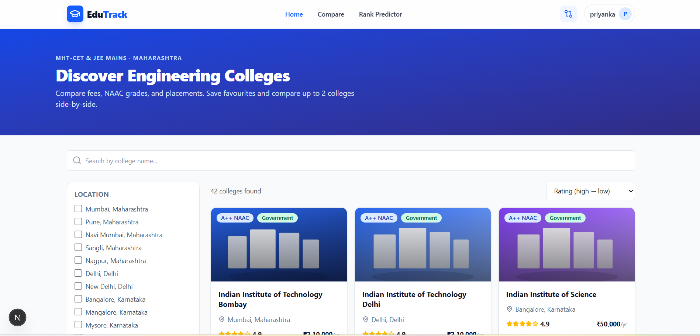
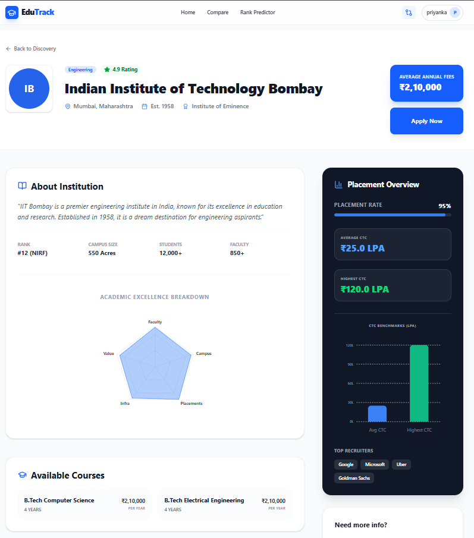
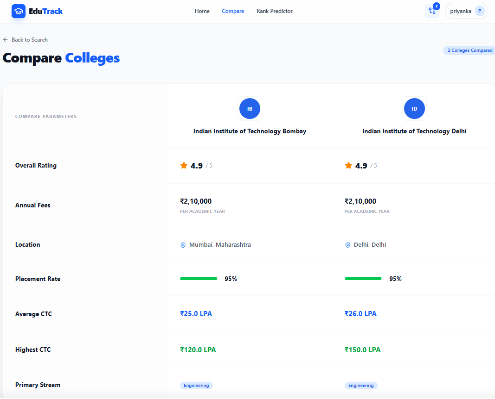
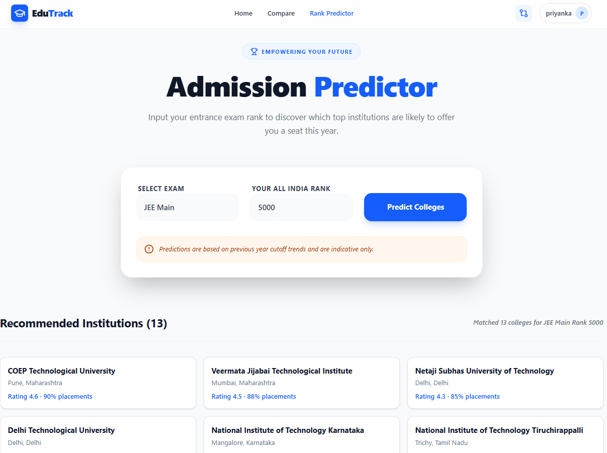
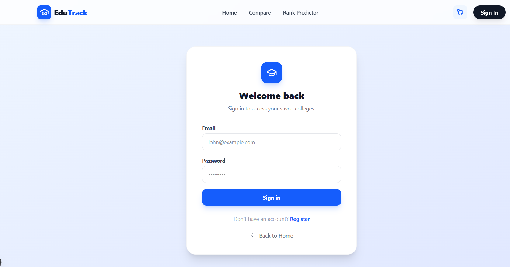
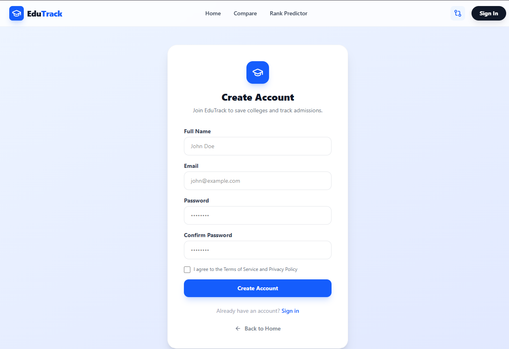
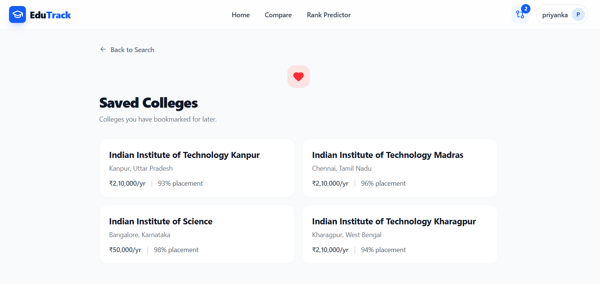

# EduTrack — College Discovery & Comparison Platform

**EduTrack** helps students discover, compare, and choose the best colleges across India. Search 42+ curated colleges, filter by location/fees/rankings, compare side-by-side, predict admissions, and save favorites — all in one place.


---

## Features

### 🔍 College Discovery

Search 42+ engineering colleges from 14 states using the home page. Filter by location (45+ cities), fees range, NAAC grade, ownership type, and engineering stream. Sort by rating or fees.

<p align="center">
  
</p>

### 📄 College Detail Pages

Every college has a dedicated detail page showing campus image, overview, courses offered, placement statistics with bar charts, rating breakdown with radar chart, student reviews, and entrance exam cutoffs.

<p align="center">
  
</p>

### ⚖️ Compare Colleges

Select up to 2 colleges and compare them side-by-side. The comparison table covers general info, fees, placement data, courses, and ratings with winner/loser highlighting. A floating bottom bar shows your selection from any page.

<p align="center">
  
</p>

### 🎯 Admission Predictor

Enter your exam (JEE Main, JEE Advanced, GATE, CAT, NEET, or MHT-CET) and rank to see which colleges you're likely to get into. Results are filtered by exam relevance — MHT-CET only shows Maharashtra colleges, JEE Advanced targets IITs, etc.

<p align="center">
  
</p>

### 🔐 User Accounts

Register or sign in with email/password (or optionally Google OAuth). Authentication gates the Predictor and Compare pages, and enables syncing saved colleges to the cloud.

<p align="center">
  
  
</p>

### ❤️ Saved Colleges

Bookmark colleges from the search grid and access them anytime from the Saved page. Saved colleges sync to your account when signed in and fall back to localStorage when offline.

<p align="center">
  
</p>


## Tech Stack

| Layer | Technology |
|---|---|
| **Framework** | Next.js 16 (App Router, Turbopack) |
| **Language** | TypeScript 5 |
| **Styling** | Tailwind CSS 4 |
| **Auth** | NextAuth.js v5 (Credentials + optional Google OAuth) |
| **Database** | PostgreSQL (Neon) + Prisma ORM |
| **State** | Zustand (with persist middleware) |
| **Forms** | React Hook Form + Zod |
| **Charts** | Recharts (BarChart, RadarChart) |
| **Icons** | Lucide React |
| **Testing** | Vitest |
| **API (3rd party)** | CollegeDB API (real-time college search) |

---

## Project Structure

```
edutrack/
├── frontend/                    # Next.js application (workspace)
│   ├── prisma/
│   │   ├── schema.prisma        # Database models
│   │   └── seed.ts              # Seed script (42 colleges, test users)
│   ├── public/colleges/         # College logo & campus SVGs
│   ├── src/
│   │   ├── app/
│   │   │   ├── page.tsx                    # Home / college discovery
│   │   │   ├── layout.tsx                  # Root layout (Navbar, CompareBar)
│   │   │   ├── (auth)/login/page.tsx       # Sign in
│   │   │   ├── (auth)/register/page.tsx    # Register
│   │   │   ├── college/[id]/page.tsx       # College detail
│   │   │   ├── compare/page.tsx            # Side-by-side comparison
│   │   │   ├── predictor/page.tsx          # Admission predictor
│   │   │   ├── saved/page.tsx              # Saved colleges
│   │   │   ├── counseling/page.tsx         # Counseling form
│   │   │   └── api/
│   │   │       ├── colleges/route.ts       # College search/filter API
│   │   │       ├── auth/[...nextauth]/     # NextAuth handlers
│   │   │       ├── auth/register/route.ts  # Registration API
│   │   │       └── saved/                  # Saved colleges CRUD
│   │   ├── components/
│   │   │   ├── auth/AuthGuard.tsx          # Inline sign-in modal
│   │   │   ├── college/                    # Card, Image, Charts
│   │   │   ├── compare/                    # Bar, Button, Table, MobileView
│   │   │   ├── listing/                    # Pagination, Sidebar, Chips
│   │   │   ├── providers/SessionProvider.tsx
│   │   │   ├── shared/Navbar.tsx
│   │   │   └── ui/                         # Button, Card, Badge, Input, etc.
│   │   ├── hooks/                          # useAuth, useColleges, useCompareStore, etc.
│   │   ├── stores/                         # Zustand stores
│   │   ├── types/college.ts                # TypeScript interfaces + constants
│   │   ├── lib/                            # Prisma client, API client, utils
│   │   └── data/
│   │       ├── seed-colleges.ts            # 42 college entries
│   │       └── college-details.ts          # Detail data (placements, courses, reviews)
│   └── .env.local                          # Secrets (AUTH_SECRET, DB URL, API key)
├── backend/                     # Express API (port 4000, optional)
├── scripts/                     # Utility scripts
├── screenshots/                 # Page previews
├── AGENTS.md                    # Dev agent instructions
└── package.json                 # Monorepo root
```

---

## Data Sources

| Source | Contents | When Used |
|---|---|---|
| **Seed data** (`seed-colleges.ts`) | 42 curated colleges with enriched metadata | Always loaded; API fallback when DB is unavailable |
| **Detail data** (`college-details.ts`) | Placement stats, courses, reviews, cutoffs for all colleges | Detail page, compare page, predictor |
| **CollegeDB API** | Real-time college search via `COLLEGEDB_API_KEY` | Search endpoint (`/api/colleges`) when API key is set |
| **Neon PostgreSQL** | User accounts, saved colleges, saved comparisons | Auth, saved page, cloud sync |


## Quick Start

### Prerequisites

- Node.js 20+
- npm 9+
- PostgreSQL (optional — seed data works without a database)

### 1. Install

```bash
git clone <repo-url>
cd edutrack
npm install
```


### 2. Database 

Skip this step to use seed data without a database. With a database:

```bash
cd frontend
npx prisma db push       # Create tables
npx prisma db seed       # Seed 42 colleges + test users
```

Test users after seeding: `alice@test.com`, `bob@test.com`, `charlie@test.com` (password: `Test1234` for all).

### 3. Run

```bash
npm run dev
```

Open [http://localhost:3000](http://localhost:3000).

### 4. Build

```bash
npm run build
```

---

## Scripts

| Command | Description |
|---|---|
| `npm run dev` | Start Next.js dev server (Turbopack) |
| `npm run build` | Generate Prisma client + production build |
| `npm run lint` | Run ESLint |
| `npm test` | Run Vitest |
| `npm run db:seed` | Seed database with colleges + test data |
| `npm run db:studio` | Open Prisma Studio (DB GUI) |

---

## API Routes

| Route | Methods | Auth | Description |
|---|---|---|---|
| `/api/colleges` | GET | No | Search/filter colleges (query: search, location, minRating, fees, stream, ownership, naac, sort, page, limit) |
| `/api/auth/[...nextauth]` | GET, POST | No | NextAuth handlers (credentials, session, optional Google OAuth) |
| `/api/auth/register` | POST | No | Create account (name, email, password) |
| `/api/saved` | GET, POST | Yes | List / save a college |
| `/api/saved/[collegeId]` | DELETE | Yes | Remove a saved college |
| `/api/saved/comparisons` | GET, POST | Yes | List / save a comparison |

---

## Auth Guard Behavior

| Protected Action | Behavior |
|---|---|
| Compare button (college card) | Shows inline sign-in modal — does not redirect |
| Compare page (`/compare`) | Redirects to `/login?callbackUrl=/compare` |
| Predictor page (`/predictor`) | Redirects to `/login?callbackUrl=/predictor` |
| Save / Bookmark (heart icon) | Works without auth (localStorage, syncs to DB on login) |
| Saved page (`/saved`) | Redirects to `/login?callbackUrl=/saved` |

---

## Exam Types Supported for Predictor

| Exam | Target Colleges |
|---|---|
| JEE Main | All NITs, IIITs, and GFTIs |
| JEE Advanced | All IITs |
| MHT-CET | Maharashtra state colleges only |
| GATE | MTech-relevant institutes |
| CAT | Management-qualifying colleges |
| NEET | Medical-qualifying colleges |

---


